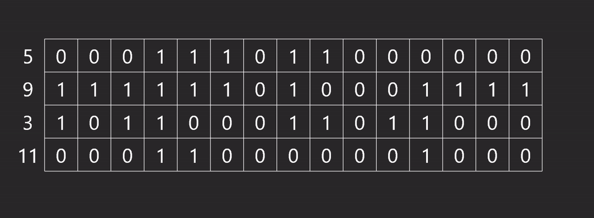
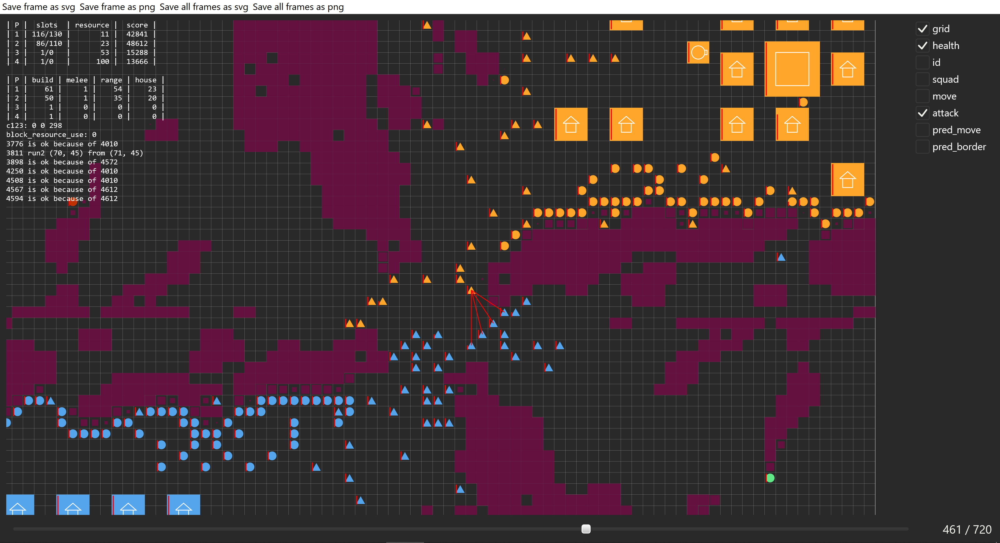

# rviewer

Draws animation from text files. Was created for AI competitions like CodinGame or RussianAiCup.

Examples can be found in the folder [examples](/examples) (along with the `.cpp` files to generate `.txt` file). For example, ready animation



Or screenshot of a working program from an actual competition:



_Full animation is in folder [images](/images)_

It can read input file online, i.e. you can call it like `main.exe | rviewer.exe` and it will draw animation as it reads frames from `main.exe`.

## File format
File consists of multiple lines, each line corresponds to an object to be drawn. Multiple frames are separated by a single line with `tick`. Everything before first occurence of `tick` will be drawn on each frame. Also, in the beginning you should specify these parameters (not all required):

+ `size (w,h)` &mdash; size of the frame
+ `speed f` &mdash; number of frames per second
+ `width w` &mdash; default width of a line
+ `svgwidth w` &mdash; factor to scale line width when converting to `svg` (default 0.3)
+ `font f` &mdash; default font size
+ `disable some_tag` &mdash; tag will be disable by default

Objects look like this: `circle c=(10,20) r=15 col=(255,255,0) f=1`. Not all parameters are required, default will be used if not specified. Spaces are important (as well as their absence in `col`, for example)

Each object can be one of those:
+ `rect` &mdash; rectangle by position and size 
  + `c=(10,20)` &mdash; position, pair of doubles
  + `a=xy` &mdash; alignment, consists of two chars, each is `B`, `C` or `E`, stands for `begin`, `center` or `end`, default is `a=CC`
  + `s=(10,20)` &mdash; size, pair of doubles
  + `col=(255,255,0)` &mdash; color, 3 or 4 integers from 0 to 255 (last one is alpha channel)
  + `f=0` &mdash; 1 or 0, fill or not
  + `w=1.5` &mdash; double, width of a border line. Works only with `f=0`

+ `circle` &mdash; circle by center and radius
  + `c=(10,20)` &mdash; center, pair of doubles
  + `r=15` &mdash; radius, double
  + `col=(255,255,0)` &mdash; color, 3 or 4 integers from 0 to 255 (last one is alpha channel)
  + `f=0` &mdash; 1 or 0, fill or not
  + `w=1.5` &mdash; double, width of a border line. Works only with `f=0`

+ `line` &mdash; line segment by two endpoints
  + `s=(10,20)` &mdash; first point, pair of doubles
  + `f=(10,20)` &mdash; second point, pair of doubles
  + `col=(255,255,0)` &mdash; color, 3 or 4 integers from 0 to 255 (last one is alpha channel)
  + `w=1.5` &mdash; double, width

+ `grid` &mdash; grid by position, size and number of cells
  + `c=(10,20)` &mdash; position, pair of doubles
  + `a=xy` &mdash; alignment, consists of two chars, each is `B`, `C` or `E`, stands for `begin`, `center` or `end`, default is `a=CC`
  + `s=(10,20)` &mdash; size, pair of doubles
  + `d=(5,8)` &mdash; number of columns and rows, pair of integers
  + `col=(255,255,0)` &mdash; color, 3 or 4 integers from 0 to 255 (last one is alpha channel)
  + `w=1.5` &mdash; double, width of a border line. Works only with `f=0`

+ `poly` &mdash; polygon or polyline by vertices
  + `p=(10,20)` &mdash; one vertex, add as many as you need in the right order
  + `col=(255,255,0)` &mdash; color, 3 or 4 integers from 0 to 255 (last one is alpha channel)
  + `f=0` &mdash; 1 or 0, fill or not (first point will be connected with last if `f=1`)
  + `w=1.5` &mdash; double, width of a border line. Works only with `f=0`

+ `text` &mdash; text
  + `c=(10,20)` &mdash; position, pair of doubles
  + `a=xy` &mdash; alignment, consists of two chars, each is `B`, `C` or `E`, stands for `begin`, `center` or `end`, default is `a=CC`
  + `s=15` &mdash; font, double
  + `col=(255,255,0)` &mdash; color, 3 or 4 integers from 0 to 255 (last one is alpha channel)
  + `m=some_text` &mdash; text, `;` will be replaced with new line symbol; if you want spaces, use quotes: `m="a b c"`

+ `msg` &mdash; message, it is not drawn as everything else, but printed in the upper left corner. Everything after `msg ` will be printed

Every object except for `msg` has one more option `t=some_tag`. This adds a tag to an object. All tags will be shown in the right part of a screen and you can disable visibility of objects with certain tag.

## Clients
All available clients are available in folder [client](/clients).
### cpp
Examples can be found in [examples](/examples) folder. The simple program will look like this:
<details>
  <summary>Code</summary>
  
  ```cpp
  Init().size({W * (m + 1), W * (n + 1)}).speed(1.5);
  Tick();
  Rect({10, 20}, {4, 3}).fill(0).color(Color::red).align('B', 'C');
  Text(to_string(123)).center({25, 35}).font(7.5).color(Color::white);
  
  // object is drawn in destructor
  auto rect = Rect({10, 20}, {4, 3}).fill(1).color(Color::orange);  // prints nothing
  rect.align('C', 'E');
  rect.tag("some_tag");
  rect.draw();  // prints rectangle with alignment and tag
  // if you don't call draw, it will be drawn in destructor anyway
  // if you don't want that, set rect.drawn_ = true
  ```
  
</details>

## Key bindings
+ Move between ticks with arrows
+ Pause and continue with space
+ Fit picture to screen size with `0`

## Export animation
`rviewer` can export one/all frames as `svg`, or one/all frames as `png`. You can configure some settings for convertion in file `settings.json` in the folder with `rviewer.exe` (it will be created on first attempt to create `png`). Conversion can be done using [Inkscape](https://inkscape.org/release) or [rsvg-convert](http://manpages.ubuntu.com/manpages/xenial/man1/rsvg-convert.1.html) (for windows you can download [here](https://community.chocolatey.org/packages/rsvg-convert)). You can specify preferred option in settings with parameter `conversion_tool`: either `rsvg-convert` or `inkscape`. It is strongly suggested to use `rsvg-convert`, because it is much faster.

To make animation from `png` images, you can use [ffmpeg](https://www.ffmpeg.org/):
```bash
# 25 frames per second
ffmpeg -r 25 -i "frames/%05d.png" -c:v libx264 -vf "pad=ceil(iw/2)*2:ceil(ih/2)*2" -pix_fmt yuv420p video.mp4
# convert video to gif, make sure to use correct scale
ffmpeg -i video.mp4 -vf "fps=25,scale=1080:-1:flags=lanczos,split[s0][s1];[s0]palettegen[p];[s1][p]paletteuse" -loop 0 out.gif
```

Button `Make animation from frames` calls first command with correct `fps`.

## Build
Download cargo from [official website](https://doc.rust-lang.org/cargo/getting-started/installation.html), clone this repo and call `cd rviewer` and `cargo build --release`. All files in `target` repository can be deleted after build, except for `rviewer.exe`. If you use Linux, you may be interested in reading [requirements](https://github.com/linebender/druid#linux) for graphics library.

## Usage
Either `rviewer.exe < file.txt` or just `rviewer.exe file.txt`.
