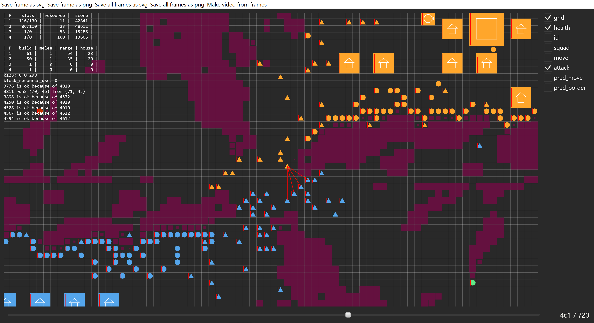

# rviewer

Draws animation from text files. Was created for AI competitions like CodinGame or RussianAiCup.

Examples can be found in the folder [examples](/examples) (along with the `.cpp` files to generate `.txt` file). For example, ready animation

Or screenshot of a working program from an actual competition:

It can read input file online, i.e. you can call it like `main.exe | rviewer.exe` and it will draw animation as it reads frames from `main.exe`.

## File format
File consists of multiple lines, each line corresponds to an object to be drawn. Multiple frames are separated by a single line with `tick`. Everything before first occurence of `tick` will be drawn on each frame. Also, in the beginning you should specify these parameters (not all required):

+ `size (w,h)` &mdash; size of the frame
+ `speed f` &mdash; number of frames per second
+ `width w` &mdash; default width of a line
+ `font f` &mdash; default font size
+ `disable some_tag` &mdash; tag will be disable by default

Objects look like this: `circle c=(10,20) r=15 col=(255,255,0) f=1`. Not all parameters are required, default will be used if not specified. Spaces are important (as well as their absence in `col`, for example)

Each object can be one of those:
+ `rect` &mdash; rectangle by center and size 
  + `c=(10,20)` &mdash; center, pair of doubles
  + `s=(10,20)` &mdash; size, pair of doubles
  + `col=(255,255,0)` &mdash; color, 3 or 4 integers from 0 to 255 (last one is alpha channel)
  + `f=0` &mdash; 1 or 0, fill or not
  + `w=1.5` &mdash; double, width of a border line. Works only with `f=0`

+ `circle` &mdash; circle by center and radius
  + `c=(10,20)` &mdash; center, pair of doubles
  + `r=15` &mdash; radius, double
  + `col=(255,255,0)` &mdash; color, 3 or 4 integers from 0 to 255 (last one is alpha channel)
  + `f=0` &mdash; 1 or 0, fill or not
  + `w=1.5` &mdash; double, width of a border line. Works only with `f=0`

+ `line` &mdash; line segment by two endpoints
  + `s=(10,20)` &mdash; first point, pair of doubles
  + `f=(10,20)` &mdash; second point, pair of doubles
  + `col=(255,255,0)` &mdash; color, 3 or 4 integers from 0 to 255 (last one is alpha channel)
  + `w=1.5` &mdash; double, width

+ `poly` &mdash; polygon or polyline by vertices
  + `p=(10,20)` &mdash; one vertex, add as many as you need in the right order
  + `col=(255,255,0)` &mdash; color, 3 or 4 integers from 0 to 255 (last one is alpha channel)
  + `f=0` &mdash; 1 or 0, fill or not (first point will be connected with last if `f=1`)
  + `w=1.5` &mdash; double, width of a border line. Works only with `f=0`

+ `text` &mdash; text
  + `c=(10,20)` &mdash; position (center of a text), pair of doubles
  + `s=15` &mdash; font, double
  + `col=(255,255,0)` &mdash; color, 3 or 4 integers from 0 to 255 (last one is alpha channel)
  + `m=some_text` &mdash; text, spaces are not allowed, `;` will be replaced with new line symbol

+ `msg` &mdash; message, it is not drawn as everything else, but printed in the upper left corner. Everything after `msg ` will be printed

Every object except for `msg` has one more option `t=some_tag`. This adds a tag to an object. All tags will be shown in the right part of a screen and you can disable visibility of objects with certain tag.

## Build
Download cargo from [official website](https://doc.rust-lang.org/cargo/getting-started/installation.html), clone this repo and call `cd rviewer` and `cargo build --release`. All files in `target` repository can be deleted after build, except for `rviewer.exe`. If you use Linux, you may be interested in reading [requirements](https://github.com/linebender/druid#linux) for graphics library.

## Usage
Either `rviewer.exe < file.txt` or just `rviewer.exe file.txt`.
